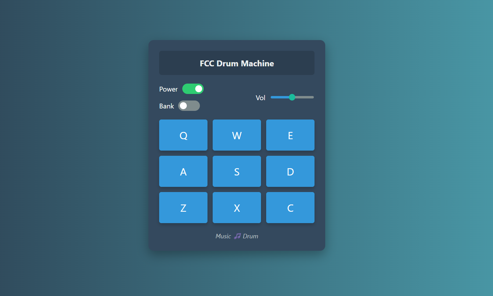

# 🎶 Music Drum Machine

A **modern and responsive Drum Machine** built using **HTML, CSS, and JavaScript**. This interactive web app lets you create beats by pressing keyboard keys or tapping on-screen pads. It includes smooth audio playback, dual sound banks, volume control, and a power toggle — all wrapped in a sleek, mobile-friendly interface.

  

---

## ⚙️ Features

- **🎧 Play 9 drum sounds** using keys: `Q`, `W`, `E`, `A`, `S`, `D`, `Z`, `X`, `C`
- **🔊 Volume control** with a stylish modern slider
- **🎼 Two sound banks**: switch easily between different sound sets
- **🔌 Power switch** to enable/disable interaction
- **📱 Fully responsive** design for desktop and mobile
- **⚡ Fast, animated UI** with immediate sound feedback

---

## 🚀 Live Demo

🔗 [Launch the Drum Machine](https://tikesh-sahu-git.github.io/Music-Drum/)  
(Make sure your GitHub Pages link is correct!)

---

## 🗂️ Project Structure

📁 Music-Drum/
├── index.html → Main HTML structure
├── styles.css → All styling and responsive design
├── script.js → JavaScript logic for sound and interaction
└── demo-screenshot.png → Screenshot used in README

## 🎮 How to Use

1. Toggle the **Power** switch to turn on the drum machine.
2. Press the pads on screen or use your keyboard (`Q–C`).
3. Adjust the **Volume** slider as needed.
4. Use the **Bank** switch to change sound sets.
5. Start jamming and have fun!

---

## 📌 Notes

- Built with **vanilla JavaScript**, **HTML**, and **CSS**.
- Works on all modern devices and browsers.
- No external libraries or frameworks required.
